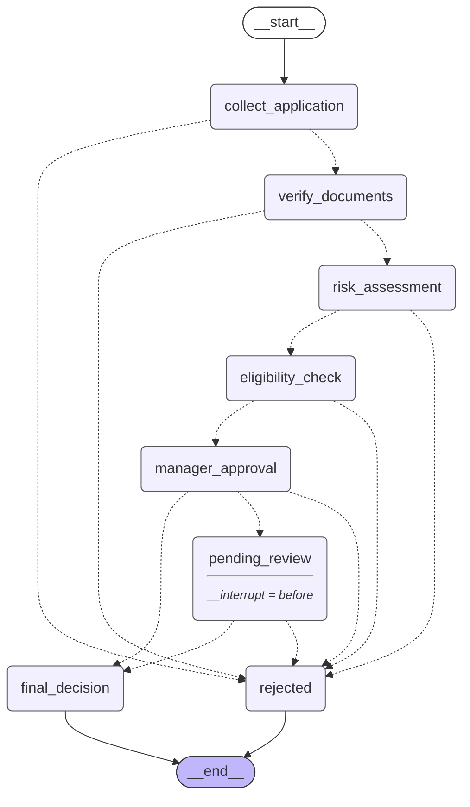

# Loan Application Processing Workflow (LangGraph)

This repository implements a production-ready, multi-stage loan application processing workflow built with **LangGraph**. It utilizes SQLite checkpointing to manage application state transitions, supports human-in-the-loop manual review, and provides a command-line interface (CLI) to submit, list, review, and audit applications.

---

## Workflow Diagram

Below is the visual structure of the StateGraph nodes, conditional edge routing, and the interrupt point before manager review:



---

## State Definition

The graph state is structured as a JSON-serializable `TypedDict` (`State` inside [`state.py`](file:///d:/Projects/Loan%20application/state.py)). It maps the following fields:

| Field | Type | Description |
|---|---|---|
| `applicant_name` | `str` | Name of the applicant |
| `applicant_age` | `int` | Age of the applicant (must be >= 18) |
| `employment_tenure_months` | `int` | Length of tenure in current employment |
| `credit_score` | `int` | Credit rating score (range: 300 to 850) |
| `monthly_income` | `float` | Monthly verifiable income in USD |
| `monthly_debt` | `float` | Monthly debt obligations in USD |
| `loan_amount` | `float` | Requested loan amount in USD |
| `loan_purpose` | `str` | Purpose of the loan (e.g. Car purchase, Home remodel) |
| `has_id` | `bool` | True if Government ID was submitted |
| `has_proof_of_income` | `bool` | True if proof of income was submitted |
| `has_bank_statement` | `bool` | True if bank statement was submitted |
| `current_stage` | `str` | Tracks the active node/stage of the workflow |
| `status` | `str` | Status of the workflow (`collecting`, `verifying`, `assessing_risk`, `checking_eligibility`, `pending_review`, `APPROVED`, `REJECTED`) |
| `risk_score` | `Optional[float]` | Computed risk score (0 to 100) |
| `rejection_reason` | `Optional[str]` | Explanation log if the loan application is rejected |
| `manager_decision` | `Optional[str]` | Action taken by manager (`PENDING`, `APPROVED`, `REJECTED`, `AUTO_APPROVED`, `AUTO_REJECTED`) |
| `manager_notes` | `Optional[str]` | Assessment notes provided during manager review |
| `audit_trail` | `List[Dict[str, Any]]` | Append-only historical log entries of all node executions |

---

## Node Descriptions

1. **`collect_application`**: Captures and validates basic applicant details. It enforces validation checks (the applicant's name must be non-empty, age must be 18 or older, and the requested loan amount must be greater than zero). If validation fails, it records the errors, updates status to `REJECTED`, and routes directly to the `rejected` terminal node.
2. **`verify_documents`**: Checks that all supporting documents are present. It validates three fields: `has_id`, `has_proof_of_income`, and `has_bank_statement`. If any of these are missing, verification fails, and the application is routed to `rejected`.
3. **`risk_assessment`**: Calculates a numeric risk score between 0 and 100 based on credit rating, Debt-to-Income (DTI) ratio, and job tenure. If the computed risk score exceeds 85, the risk is deemed too high, and the application is routed to `rejected`.
4. **`eligibility_check`**: Checks compliance against basic lending rules. It enforces a minimum credit score of 600 and a maximum Loan-to-Income (LTI) ratio of 4.5. If the applicant fails either criteria, the application is rejected.
5. **`manager_approval`**: Analyzes the application variables to route it:
   - **Auto-Approval**: Triggered for low-risk, small loans (risk score < 30 and loan amount < $25,000). Routes directly to `final_decision`.
   - **Auto-Rejection**: Triggered for high-risk applications (risk score > 75). Routes directly to `rejected`.
   - **Manual Review**: Any application in between is marked as `PENDING` and routed to `pending_review`.
6. **`pending_review`**: This is a human-in-the-loop pause point. The graph halts execution before running this node. Once a manager reviews and updates the state with their decision (`APPROVED` or `REJECTED`) and notes, execution resumes, processes the decision, and routes to the appropriate terminal node.
7. **`final_decision`**: Mark status as `APPROVED`, adds the approval stamp to the audit log, and transitions to graph completion.
8. **`rejected`**: Marks status as `REJECTED`, records the final failure reason, and transitions to graph completion.

---

## Conditional Edge Logic

Instead of inline transitions, routers read the state parameters to determine routing:

| From Node | Router Condition | To Node on Match | To Node on Else/Fallback |
|---|---|---|---|
| `collect_application` | `state["status"] == "REJECTED"` | `rejected` | `verify_documents` |
| `verify_documents` | `state["status"] == "REJECTED"` | `rejected` | `risk_assessment` |
| `risk_assessment` | `state["status"] == "REJECTED"` | `rejected` | `eligibility_check` |
| `eligibility_check` | `state["status"] == "REJECTED"` | `rejected` | `manager_approval` |
| `manager_approval` | `state["manager_decision"] == "AUTO_APPROVED"`<br>`state["manager_decision"] == "AUTO_REJECTED"` | `final_decision`<br>`rejected` | `pending_review` |
| `pending_review` | `state["status"] == "APPROVED"`<br>`state["status"] == "REJECTED"` | `final_decision`<br>`rejected` | `pending_review` (stay paused) |

---

## Checkpoint Strategy

*   **Checkpointer**: We use LangGraph's native `SqliteSaver` to persist state checkpoints to an SQLite database file.
*   **Trigger**: Checkpoints are automatically saved after every node execution.
*   **Thread ID Persistence**: State history is tied to a unique `thread_id` (a UUID generated for each loan). This allows restoring state history at any point.
*   **Resuming Paused Workflows**: The state machine is compiled with `interrupt_before=["pending_review"]`. When the graph runs and matches manual review, it stops before running `pending_review`. To resume:
    1. The manager updates the thread state with the decision (e.g. `APPROVED`) via `app.update_state()`.
    2. The manager resumes graph execution by passing `None` as the input stream payload. LangGraph fetches the checkpoints using the `thread_id` and continues execution.
*   **Querying Applications**: To avoid unpacking binary database checkpoints, we maintain a lightweight queryable SQLite metadata table (`loan_applications`) in the same database. This table stores summaries and can be queried instantly by status (e.g. `pending_review`) through the CLI or standard SQL.

---

## Setup & Running CLI

### 1. Installation
Clone the repository and install the dependencies:
```bash
pip install -r requirements.txt
```

### 2. Environment Setup
Copy the template `.env.example` file to `.env`:
```bash
copy .env.example .env
```
*(Optionally change database path in `.env`)*

### 3. Detailed CLI Usage Commands

The `main.py` CLI is your primary interface for interacting with the loan application workflow.

#### Submit an Application

The `submit` command accepts the following parameters to start a new application workflow:
- `--name`: Full name of the applicant (e.g., "Alice Smith")
- `--age`: Age of the applicant (must be >= 18)
- `--tenure`: Current job tenure in months
- `--credit`: Credit score (300-850)
- `--income`: Monthly verified income in USD
- `--debt`: Total monthly debt obligations in USD
- `--amount`: The requested loan amount in USD
- `--purpose`: Reason for the loan (e.g., "Home Improvement")
- `--has-id`: Flag to indicate ID was submitted
- `--has-income`: Flag to indicate proof of income was submitted
- `--has-bank`: Flag to indicate bank statements were submitted

**Example: Auto-Approve Scenario**
Submit a low-risk, small-amount loan ($15,000) that passes all checks and gets auto-approved:
```bash
# (Old workflow) python main.py submit --name "Alice Smith" --age 30 --tenure 36 --credit 800 --income 10000 --debt 500 --amount 15000 --purpose "Car Purchase" --has-id --has-income --has-bank
python src/loan_app/main.py submit --name "Alice Smith" --age 30 --tenure 36 --credit 800 --income 10000 --debt 500 --amount 15000 --purpose "Car Purchase" --has-id --has-income --has-bank
```
*Output will stream the graph execution nodes and end with an `APPROVED` status.*

**Example: Manual Review Scenario**
Submit a loan of $40,000. It passes validations but exceeds the auto-approval threshold ($25,000), prompting a human review pause:
```bash
# (Old workflow) python main.py submit --name "Bob Johnson" --age 28 --tenure 18 --credit 700 --income 6000 --debt 1800 --amount 40000 --purpose "Medical Bills" --has-id --has-income --has-bank
python src/loan_app/main.py submit --name "Bob Johnson" --age 28 --tenure 18 --credit 700 --income 6000 --debt 1800 --amount 40000 --purpose "Medical Bills" --has-id --has-income --has-bank
```
*Output will end with a `pending_review` status and provide a Thread ID for you to resume it.*

#### List Applications
Show all applications in the system, displaying their Thread ID, amount, current stage, and status:
```bash
# (Old workflow) python main.py list
python src/loan_app/main.py list
```

Filter by status (e.g., to find all loans requiring a manager's attention):
```bash
# (Old workflow) python main.py list --status pending_review
python src/loan_app/main.py list --status pending_review
```

#### Review & Resume a Paused Application
When an application is in the `pending_review` state, a manager needs to provide a decision to resume the graph execution.

**Parameters:**
- `--thread-id`: The UUID of the application (found via the `list` command)
- `--decision`: Must be either `APPROVED` or `REJECTED`
- `--notes`: Justification or notes from the manager

**Example:**
```bash
# (Old workflow) python main.py review --thread-id <THREAD-ID> --decision APPROVED --notes "Manually verified employer stability. Approved."
python src/loan_app/main.py review --thread-id <THREAD-ID> --decision APPROVED --notes "Manually verified employer stability. Approved."
```

#### View Application Details and Audit Trail
Retrieve the complete snapshot of a specific application, including the calculated risk score and a chronological audit trail of all node transitions.
```bash
# (Old workflow) python main.py view --thread-id <THREAD-ID>
python src/loan_app/main.py view --thread-id <THREAD-ID>
```

---

## Automated Tests

We use `pytest` to verify correctness. The test suite uses isolated, in-memory checkpointer sessions to ensure tests are fast and repeatable.

### Running Tests
Execute the tests using:
```bash
pytest -v
```

### Test Coverage Table
Our tests cover the following scenarios:

| Test Case | Description / Coverage | Expected Outcome |
|---|---|---|
| `test_auto_approval_path` | High-credit, low-amount, low-risk loan with all documents. | Auto-approved to `APPROVED` status. |
| `test_rejection_at_verify_documents` | Missing proof of ID or bank statements. | Rejected at `verify_documents` stage. |
| `test_rejection_at_risk_assessment` | Evaluates low credit, short job tenure, and high DTI. | Rejected at `risk_assessment` stage (risk > 85). |
| `test_rejection_at_eligibility_credit_score` | Credit score is < 600 but passes the risk threshold. | Rejected at `eligibility_check` stage. |
| `test_rejection_at_eligibility_loan_to_income` | Loan amount exceeds 4.5 times the annual income. | Rejected at `eligibility_check` stage. |
| `test_manual_review_routing_and_approval` | Large amount loan paused at review, then resumed and approved. | Transitioned from `pending_review` to `APPROVED`. |
| `test_manual_review_routing_and_rejection` | Large amount loan paused at review, then resumed and rejected. | Transitioned from `pending_review` to `REJECTED`. |
| `test_audit_trail_sequencing` | Audits that steps are written in order with chronological timestamps. | 6 sequential audit logs matching graph flow. |
